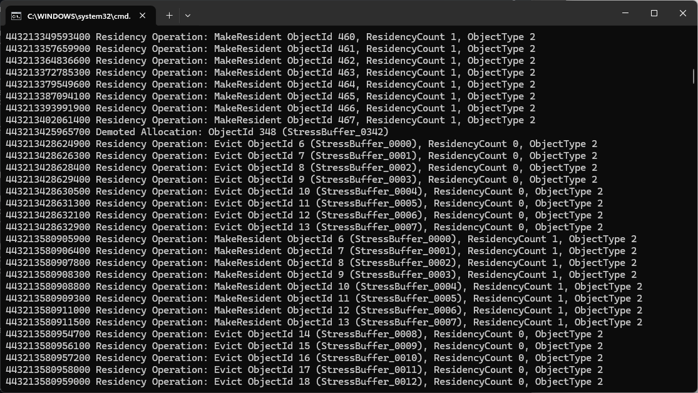

# DxTimingCaptureLibrary basic sample

Start here. This sample implements every callback interface with a simple `printf`, so you can see what the library reports and when. It also shows the full setup: creating a real-time ETW session, enabling the DirectX providers, feeding events to the library, handling errors, and reporting data loss.



## Usage

```text
DxTimingCaptureLibrary.sample.exe [processId]
```

With no process ID it observes itself. Press Ctrl+C to stop.

Live capture opens a real-time ETW session, so you need to be an administrator or a member of **Performance Log Users**.
