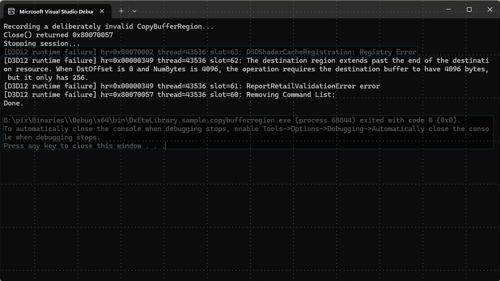

# DxTimingCaptureLibrary D3D12 journal sample

This sample shows how to get D3D12 runtime errors without the debug layer.

It implements `RuntimeFailureCallbacks` and then deliberately records a bad `CopyBufferRegion` call that reads past the end of the source buffer. The D3D12 runtime rejects it, removes the command list, and writes an entry to its journal. The library decodes that entry and the sample prints it.

You get less detail than the debug layer, but a lot more than a bare `E_INVALIDARG`, and it works on retail runtimes.



## Usage

```text
DxTimingCaptureLibrary.sample.journal.exe
```

It takes no arguments and exits after about a second. You need to be an administrator or a member of **Performance Log Users** to start the ETW session.
