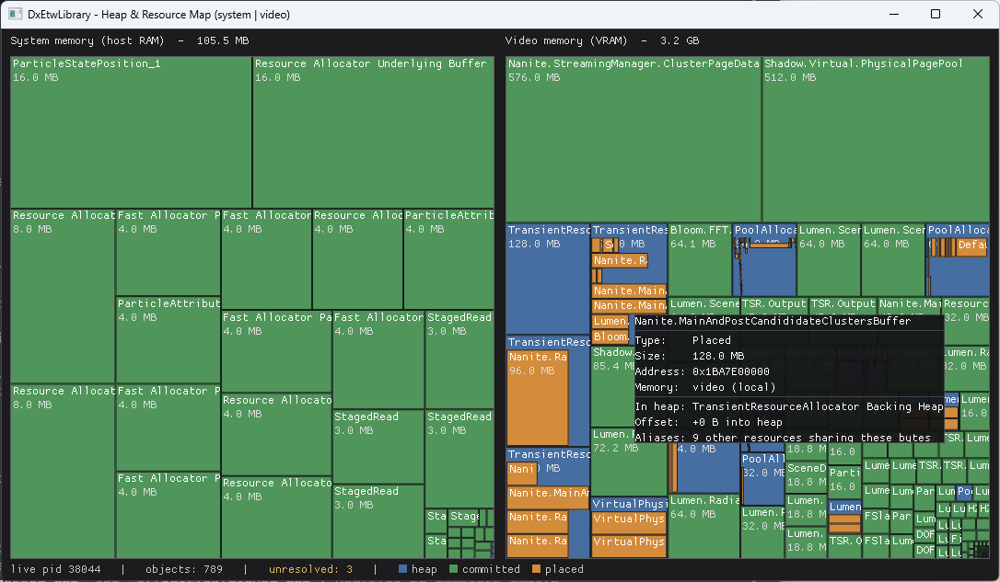

# DxTimingCaptureLibrary memory-map sample

Draws two [WinDirStat](https://windirstat.net/)-style treemaps of a process's
live D3D12 memory: **system memory (host RAM) on the left, video memory (VRAM)
on the right**. Each rectangle is a heap or resource, sized in proportion to its
allocation and labelled with its name. It's a quick way to see *where* an app's
resources actually live.



It consumes the memory-location data DxTimingCaptureLibrary reports per object
(`ObjectPlacementInfo::ResidentSegmentGroup` and the
`ResidencyEventCallbacks::OnAllocationSegmentGroupChanges` migration signal).

## Work in progress

This sample isn't finished yet. Known issues:

- It doesn't pick up every resource, so the totals can be lower than the app's
  real usage.
- It doesn't handle resources changing location. If something moves between
  system and video memory after it's first placed, the map can show it on the
  wrong side.

## How it draws things

- **Committed resources** and **explicit heaps** are top-level rectangles on the
  side (system or video) matching their current segment group.
- **Placed resources** nest *inside* their heap's rectangle - the heap is found
  by GPU-virtual-address containment, so placed resources are drawn on the
  same side as their heap and nothing gets double-counted.
- **Unknown** (segment group not resolved yet) objects aren't drawn on either
  side; their count shows in the status bar. This is normal for a moment right
  after creation, until the DXGK paging events that pin down the pool arrive.

## Usage

```
DxTimingCaptureLibrary.sample.memorymap --pid <id>        # observe a running process
DxTimingCaptureLibrary.sample.memorymap --launch <exe>    # launch + capture from the start
DxTimingCaptureLibrary.sample.memorymap --etl <path> --pid <id>   # replay a saved trace
DxTimingCaptureLibrary.sample.memorymap --demo            # synthetic data, no GPU/ETW
```

| Option | Meaning |
| --- | --- |
| `--pid <id>` | Observe an already-running process. |
| `--launch <exe>` | Launch `<exe>` suspended, start the trace, then resume it. Prefer this to see **explicit heaps and placed resources** - D3D12's ETW rundown re-emits committed resources for an already-running process, but not explicit heaps or placed resources, so those only show up when you're capturing from the start. |
| `--etl <path>` | Replay a saved `.etl` instead of capturing live (needs `--pid`). |
| `--demo` | Populate the view with synthetic data - handy to see the layout with no GPU or ETW permissions. |
| `--dump` | Print the model as text and exit, instead of opening a window. Useful headlessly. |
| `--seconds <n>` | For live `--dump`, how long to capture (default 10). |

Live capture opens a real-time ETW session, so you need to be an administrator
or a member of **Performance Log Users**.

## Rendering

Dear ImGui (vendored under [`third_party/imgui`](../../third_party/imgui)) on a Win32 + Direct3D 11 host. The
treemaps are painted straight into ImGui's draw list, and the window redraws
every frame so it updates live as the target app allocates and frees memory.
