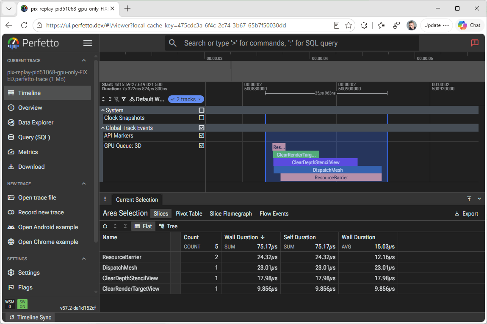

# DxTimingCaptureLibrary Perfetto sample

This sample turns the library's GPU timing callbacks into a [Perfetto](https://perfetto.dev) trace. Each command list's top-of-pipe and end-of-pipe timestamps show up on a GPU queue track, linked to the CPU-side API marker where the work was recorded.



## Usage

```text
DxTimingCaptureLibrary.sample.perfetto.exe [targetProcessId|all] [seconds] [--all-categories] [--no-other-processes] [--etl <path>]
```

| Option | Meaning |
| --- | --- |
| `targetProcessId` | Process to look at in detail. Other processes only show up on the engine activity tracks. |
| `all` | Show every D3D12 process in detail (the default). D3D12 object tracking is off in this mode. |
| `seconds` | Stop after N seconds. Without it, the sample runs until Ctrl+C. |
| `--all-categories`, `-c` | Also capture D3D12 object lifetimes, API command queues, and PSO compiles. |
| `--no-other-processes` | Drop the machine-wide GPU activity tracks, which can crowd the target out of the trace buffer on a busy machine. |
| `--etl <path>` | Process a saved `.etl` file instead of a live session. `seconds` is ignored. |

It writes `dxtimingcapture.perfetto-trace` to the current directory. Open that in [ui.perfetto.dev](https://ui.perfetto.dev).

Live capture needs administrator rights or membership in **Performance Log Users**.
